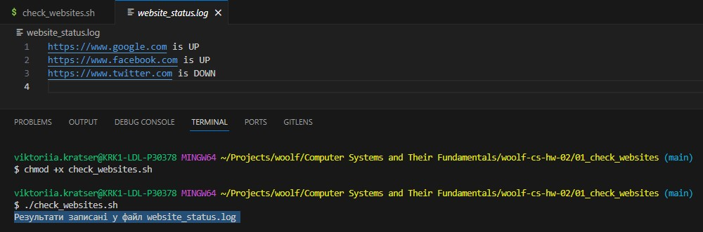

# woolf-cs-hw-02

Завдання 1:
- Скрипт написано на Bash.

- Використано цикл для обходу всіх сайтів у списку.

- Використано команду curl для перевірки HTTP-відповідей.

- Результати перевірки записані у файл логів, виведено про це повідомлення.

