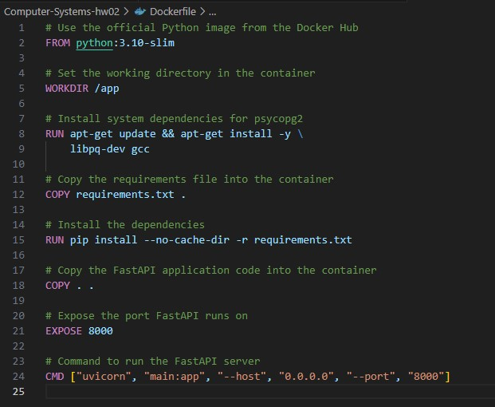
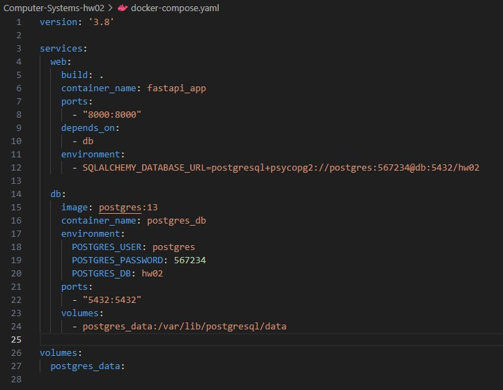
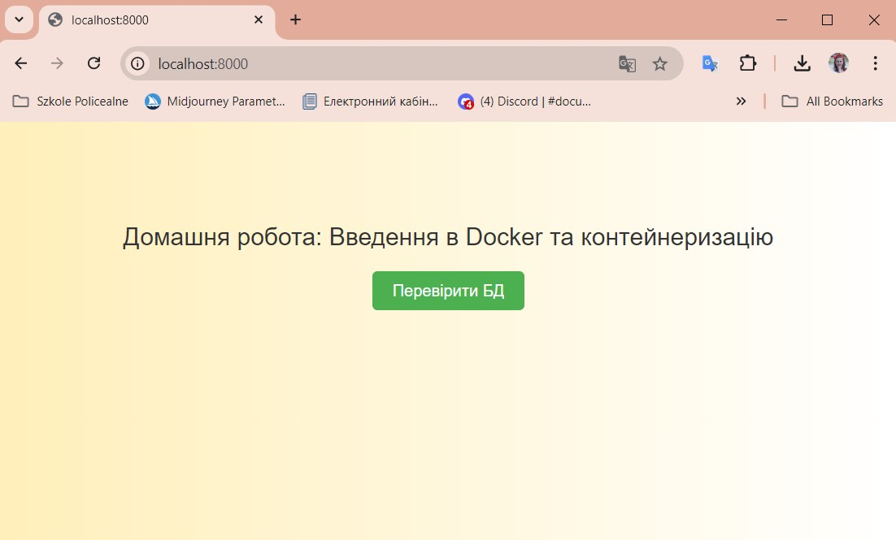
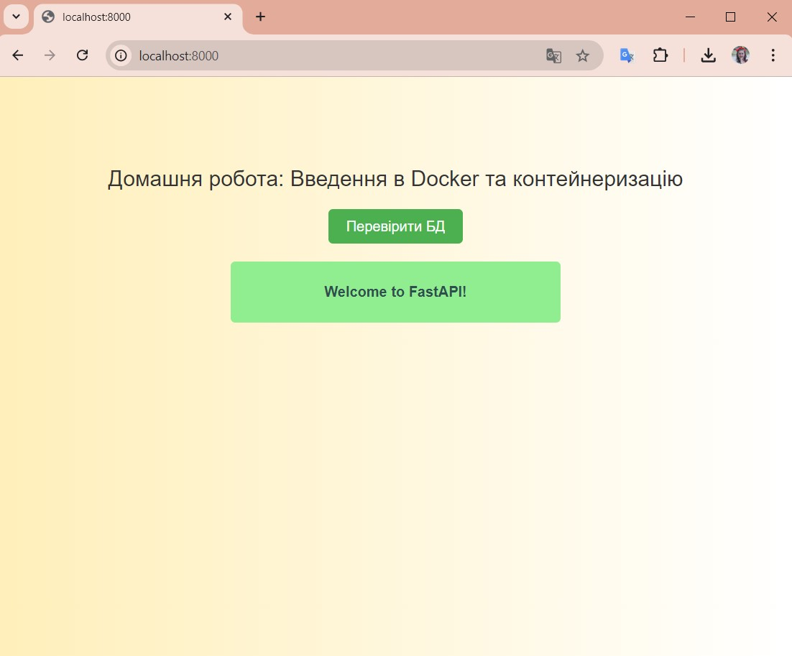

# woolf-cs-hw-02

### Завдання 1:

- Скрипт написано на Bash.

- Використано цикл для обходу всіх сайтів у списку.

- Використано команду curl для перевірки HTTP-відповідей.

- Надано файлу права на виконання:
    
    ```chmod +x check_websites.sh```

- Запущено скрипт:
    
    ```./check_websites.sh```

- Результати перевірки записані у файл логів, виведено про це повідомлення.


### Завдання 2:

- Клоновано репозиторій (https://github.com/GoIT-Python-Web/Computer-Systems-hw02), створено Dockerfile для створення образу Docker застосунку.



- Написано docker-compose.yaml з конфігурацією для застосунку та PostgreSQL.



- Використано Docker Compose, команду ```docker-compose up --build``` для побудови та запуску середовища.

- Застосунок є функціональним, а база даних — доступною, що підтверджується натисканням кнопки Перевірити БД.

**Before push button:**


**After push button:**
